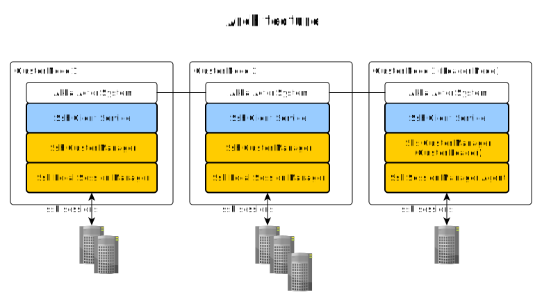
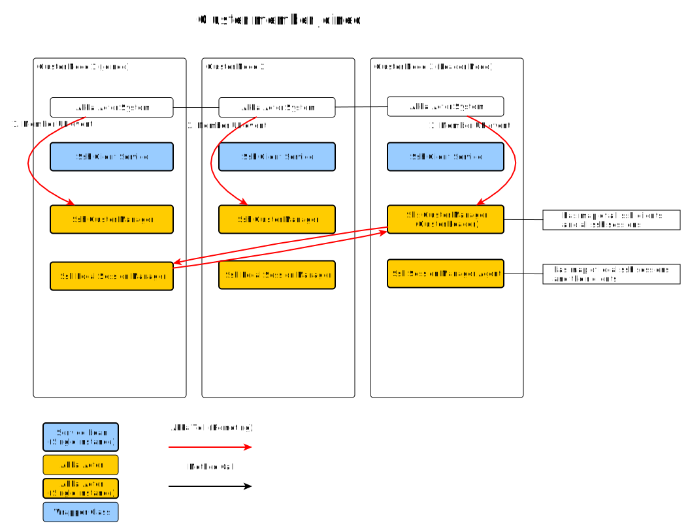
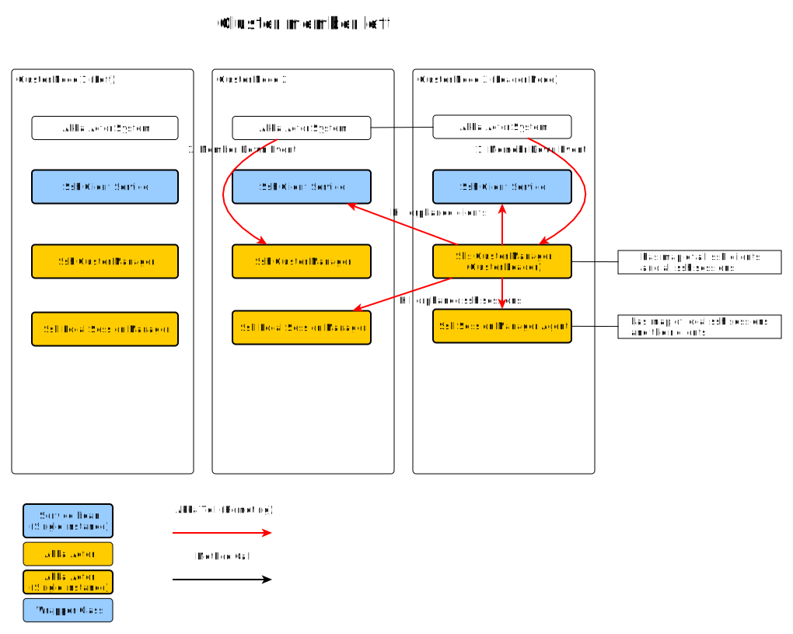
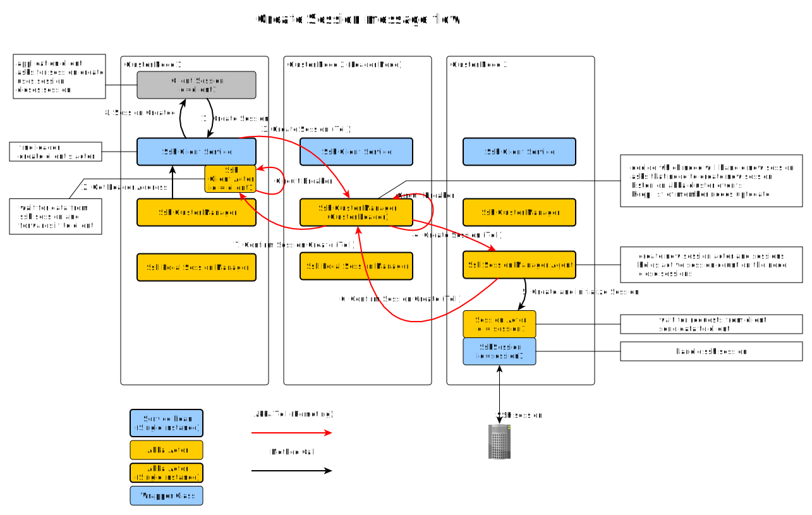
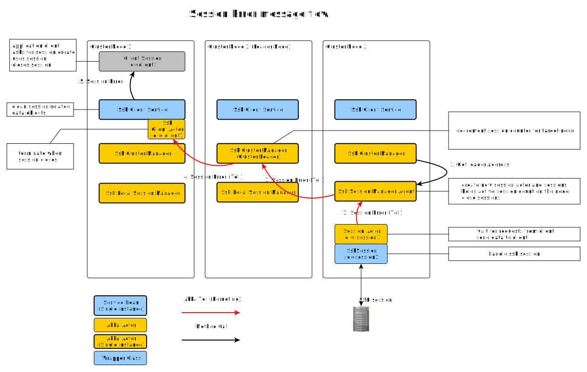
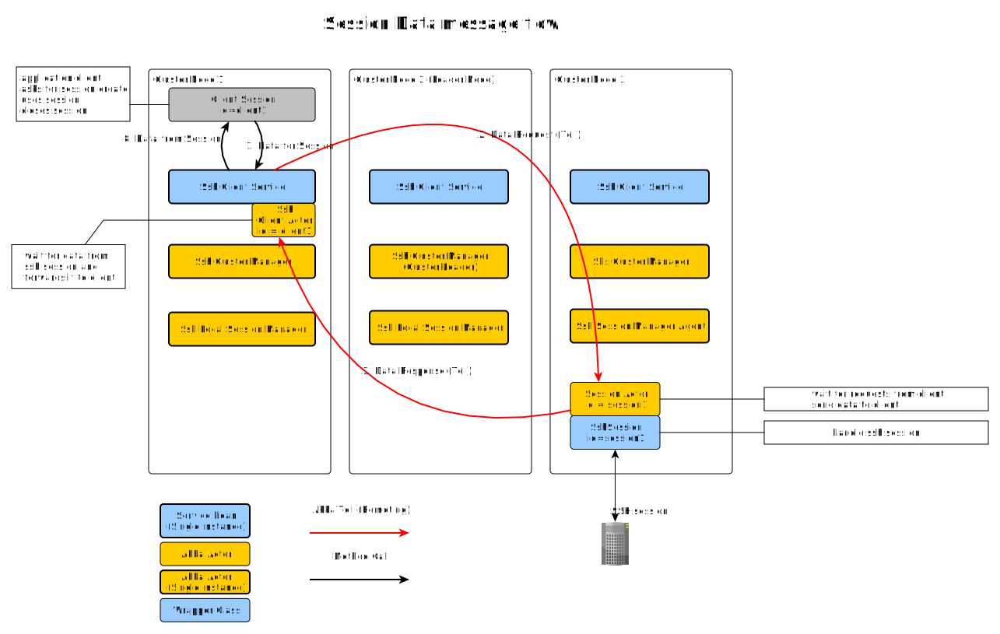

# Akka cluster demo
This is the demo of clustered service which provides 
ssh connection to clients and runs in [akka](https://akka.io/) 
[cluster](https://doc.akka.io/docs/akka/current/cluster-usage.html).



## Message flows







### Build and Install
```
gradle clean test installDist
```

### Run cluster or standalone
Run application as 3-node cluster.
```
gradle clean installDist
./docs/bin/start-node-01.sh
./docs/bin/start-node-02.sh
./docs/bin/start-node-03.sh
```
Run 3 node cluster in one terminal window (requires tmux)
```
./docs/bin/start-cluster.sh
```
Run standalone node
```
./docs/bin/start-single-node.sh
```

### TCP ports 
| node        | akka port      | management http_port |
|-------------|----------------|----------------------|
| single-node | 127.0.0.1:2550 | 127.0.0.1:8558       |
| node-01     | 127.0.0.1:2550 | 127.0.0.1:8558       |
| node-02     | 127.0.0.1:2551 | 127.0.0.1:8559       |
| node-03     | 127.0.0.1:2552 | 127.0.0.1:8560       |

### Akka management
Each node has [akka management](https://doc.akka.io/docs/akka-management/current/) active. 
See also [Cluster HTTP Management](https://doc.akka.io/docs/akka-management/current/cluster-http-management.html).
Cluster status of each node is visible at URL:

__GET__ http://127.0.0.1:{http_port}/management/cluster/members/

__GET__ http://127.0.0.1:{http_port}/management/bootstrap/seed-nodes