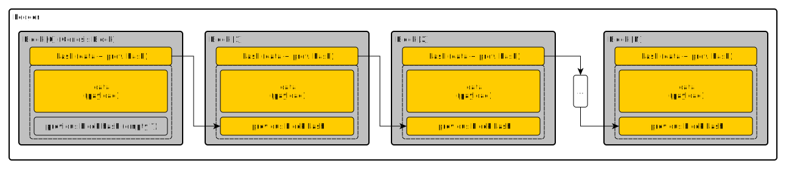

# Simple BlockChain

This is simple block-chain library for java.


* __ledger__ - Keeps the ordered sequence of blocks.
* __genesis block__ - First block in the ledger. Hash of previous block in genesis block is empty or of any value.
* __hash__ - contains hash of data and previous block hash combined.
* __data__ - useful data payload. 

#### Build & Test
```gradle clean install test publishToMavenLocal```

#### Include dependency
```
<dependency>
  <groupId>itx.blockchain</groupId>
  <artifactId>blockchain</artifactId>
  <version>1.0.0</version>
</dependency>
```
```
compile 'itx.blockchain:blockchain:1.0.0'
```

### Features implemented
1. __Basic Ledger__ - basic ledger implementation ```itx.blockchain.api.*```
   Example of use: ```itx.blockchain.test.LedgerTest```
2. __Proof-of-work ledger__ - extensions for proof-of-work ledger ```itx.blockchain.pow.*```
   Example of use: ```itx.blockchain.test.PowTests```
3. __Signed Data payload__ - utilities for signed data payload io operations ```itx.blockchain.signed```.
   Example of use: ```itx.blockchain.test.SignedDataTests```
