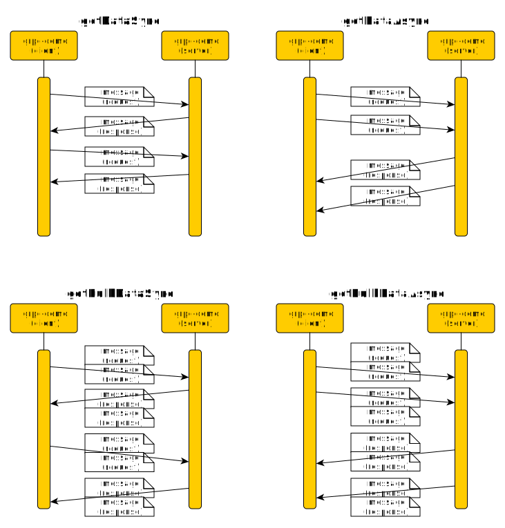

gRPC simple demo
================
This example implements very simple demo of [gRPC](https://grpc.io/) communication
between simple server and client application. Once server is
started, client connects to the server and can run one of pre-defined
scenarios. Server always responds to particular client scenario.

Build and Install
-----------------
```gradle clean installDist distZip```  
```./build/install/grpc-demo/bin/grpc-demo --help```

Run Server
----------
```./build/install/grpc-demo/bin/grpc-demo --host <interfaceIp> --port 50051```


Run Client
----------
```./build/install/grpc-demo/bin/grpc-demo --host <serverHostName> --port 50051 <scenarioName> <scenarioParameters>```

Supported client scenarios
--------------------------

#### sayHello 
Client sends single hello message to server synchronously and ends. Server responds with hello reply message.  
```./build/install/grpc-demo/bin/grpc-demo --host localhost --port 50051 sayHello -m hi```



#### getDataSync
Client sends synchronously several warm-up messages and than number of data messages to server synchronously and ends. 
Server replies with sending back same message for every received message.
Example shows getDataSync with 500 warm-up messages and 1k data messages. Test is repeated 5 times, each time time and performance is printed 
on stdout when done.  
```./build/install/grpc-demo/bin/grpc-demo --host localhost --port 50051 getDataSync -w 500 -c 1000 -m hi -r 5```

#### getDataAsync
Client sends asynchronously several warm-up messages and than number of data messages to server asynchronously and ends.
Server replies with sending back same message for every received message.
Example shows getDataSync with 500 warm-up messages and 1k data messages. Test is repeated 5 times, each time time and performance is printed 
on stdout when done.  
```./build/install/grpc-demo/bin/grpc-demo --host localhost --port 50051 getDataAsync -w 500 -c 1000 -m hi -r 5```

#### getBulkDataSync
Same test as __getDataSync__, but messages are send in groups rather than individually.
```./build/install/grpc-demo/bin/grpc-demo --host localhost --port 50051 getBulkDataSync -w 500 -c 1000 -m hi -r 5 -b 10```

#### getBulkDataAsync
Same test as __getDataAsync__, but messages are send in groups rather than individually.
```./build/install/grpc-demo/bin/grpc-demo --host localhost --port 50051 getBuklDataAsync -w 500 -c 1000 -m hi -r 5 -b 10```

Performance measurements
------------------------
Here are some performance measurements of for synchronous and asynchronous message sending.  
DataMessage exchanged between client and server in those tests looks like this: ```{ index: $i, message: "payload" }```

| Scenario        | Test Parameters                | Server       | Client         | Network   |  Result [msg/s] |
|-----------------|--------------------------------|--------------|----------------|:---------:|----------------:|
| getDataSync     |-c 100000 -r 20 -m payload      |i7-4810MQ CPU | i7-4810MQ CPU  | localhost |   9 000         |
| getDataAsync    |-c 100000 -r 20 -m payload      |i7-4810MQ CPU | i7-4810MQ CPU  | localhost |  42 000         |
| getBulkDataSync |-c 100000 -r 20 -m payload -b 10|i7-4810MQ CPU | i7-4810MQ CPU  | localhost |  88 000         |
| getBulkDataAsync|-c 100000 -r 20 -m payload -b 10|i7-4810MQ CPU | i7-4810MQ CPU  | localhost | 400 000         |
| getDataSync     |-c 100000 -r 20 -m payload      |i7-3632QM CPU | i7-4810MQ CPU  | 1 Gb/s    |   1 600         |
| getDataAsync    |-c 100000 -r 20 -m payload      |i7-3632QM CPU | i7-4810MQ CPU  | 1 Gb/s    |  37 000         |
| getBulkDataSync |-c 100000 -r 20 -m payload -b 10|i7-3632QM CPU | i7-3632QM CPU  | 1 Gb/s    |  16 000         |
| getBulkDataAsync|-c 100000 -r 20 -m payload -b 10|i7-3632QM CPU | i7-3632QM CPU  | 1 Gb/s    | 345 000         |

