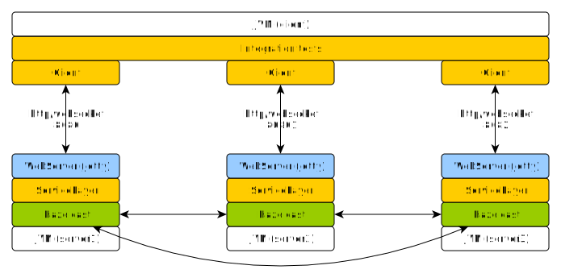

# Hazelcast cluster demo
Simple clustering demo using hazelcast and jetty to create application cluster.
When instances of server-node are started on same network, they form hazelcast cluster automatically.
Architecture below shows 3-node cluster example. This cluster application is dynamic, nodes may be added or removed.

### use of proto3 messages
Data objects stored in hazelcast are proto3 messages defined in [messages.proto](common/src/main/proto/messages.proto).
The reason why [proto3](https://developers.google.com/protocol-buffers/docs/proto3) message format is used,
is that this example avoids standard java serialization and reuses serialization and deserialization provided by proto3 messages.

## Architecture



## Build and run
```gradle clean build installDist distZip```

Start server-node instance.
```./server-node/build/install/server-node/bin/server-node```
Web server port id set to avoid conflict on same ip-address.
First server-node started will use port 8080, second server-node in cluster will use web server port 8081,
third will use 8082 an so on.

## Run integration tests
In order to run integration tests, JDK 11 and tmux has to be installed.
1. Build project and distribution.
   ```
   gradle clean build installDist
   ```
2. Start 3-node cluster in new terminal using script below.
   Wait till cluster is formed.
   ```
   ./start-3-node-cluster.sh
   ```    
3. While cluster is running, run integration tests in new terminal window.
   ```
   gradle clean test -Dtest.profile=integration
   ```
