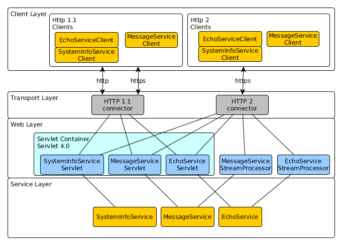

# Jetty HTTP2 server/client demo
This demo shows capabilities of [Jetty](https://www.eclipse.org/jetty/) server, [Servlet 4.0 APIs](https://jcp.org/en/jsr/detail?id=369) and Http2. 
Services deployed in this demo are accessible via HTT1.1 and HTTP2. 

## Architecture


* __client layer__ - in this demo it is implemented as TestNG integration tests.
                     See package ```itx.examples.jetty.client.*``` and TestNG client tests in ```itx.examples.jetty.tests.*```
* __transport layer__ - jetty is started with two connectors (http1.1 and http2). Http 1.1 communication may use secure and non-secure transport. 
                     Http2 uses only secure transport. See ```itx.examples.jetty.server.ServerBuilder```                       
* __web layer__ - uses servlets and stream processors to access services below. 
                     Servlets are implemented in ```itx.examples.jetty.server.servlet.*``` 
                     and stream processors are implemented in ```itx.examples.jetty.server.streams.*```
                     Stream processors are used for full-duplex communication between client and server.
* __service layer__ - implements some demo services, so there are data available for testing.
                     Services must be thread-safe, because they are accessed from concurrent clients.
                     See ```itx.examples.jetty.server.services.*```.

Server URLs:
```
http://localhost:8080/static/index.html
https://localhost:8443/static/index.html

GET HTTP 1.1 http://localhost:8080/data/system/info
GET HTTP 2.0 https://localhost:8443/data/system/info

GET HTTP 1.1 http://localhost:8080/data/echo/helloworld
GET HTTP 2.0 https://localhost:8443/data/echo/helloworld
```
See also attached postman [file](docs/jetty-http2.postman_collection.json).

## TODO
Http2 stream full-duplex communication is not fully implemented for MassageService.

## Build and Run 
Build from commandline: 
```
gradle clean build installDist distZip
```

Run server: 
```
./build/install/jetty-servlet4-http2/bin/jetty-servlet4-http2
```

### Run Integration Tests
Integration tests in this demo are designed to run as http client against running server instance.
It is expected that server runs on localhost, ports 8080 for http and 8443 for https.
Follow this procedure to run integration tests:
1. Start server manually in new terminal window.
```
./build/install/jetty-servlet4-http2/bin/jetty-servlet4-http2
```
2. Start unit integration tests in new terminal window.
```
gradle clean test -Dtest.profile=integration
```
