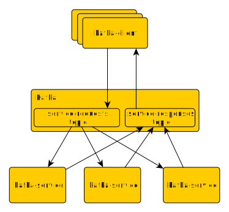

# Kafka Producer / Consumer example
This is simple demo of [Apache Kafka](https://kafka.apache.org/) service integration.
__kafka-client__ applications are sending requests to topic with 3 partitions. Each client is kafka producer and consumer at same time. It uses 
same record key randomly initialized in client startup when sending records to topic. Kafka distributes records with same key to one topic partition 
thus such messages are processed with same instance of __kafka-service__. Responses are send to common topic which is consumed by each client.
Each client filters responses by request key and waits for it's result. 

### Architecture



### Demo properties
* kafka-client does not know which kafka-service will process it's request. 
  That is determined by kafka based on key hash of data record.
* messages with same key are processed by same kafka-service instance.
* each kafka-client receives response by consuming same topic and filtering responses by request key.
* to scale backend (kafka-service) horizontally, add more instances of kafka-service and add more topic partitions in service-requests topic.

## Setup Kafka 
Download [kafka build](https://www.apache.org/dyn/closer.cgi?path=/kafka/2.2.0/kafka_2.12-2.2.0.tgz) and extract it.
```
tar -xzf kafka_2.13-2.6.0.tgz
cd kafka_2.13-2.6.0
```
Start zookeeper and kafka.
```
bin/zookeeper-server-start.sh config/zookeeper.properties
bin/kafka-server-start.sh config/server.properties
```
Create single topic 'test'.
```
bin/kafka-topics.sh --create --bootstrap-server localhost:9092 --replication-factor 1 --partitions 3 --topic service-requests
bin/kafka-topics.sh --create --bootstrap-server localhost:9092 --replication-factor 1 --partitions 1 --topic service-responses
bin/kafka-topics.sh --list --bootstrap-server localhost:9092
bin/kafka-topics.sh --describe --bootstrap-server localhost:9092
bin/kafka-topics.sh --delete --bootstrap-server localhost:9092 --topic service-requests
bin/kafka-topics.sh --delete --bootstrap-server localhost:9092 --topic service-responses
``` 

## Compile and run
1. Compile the project using gradle.
```
gradle clean build installDist distZip
```
2. Start zookeeper anf kafka and create topics as described above.
3. Start 3 instances of backend services
```
kafka-service/build/install/kafka-service/bin/kafka-service -i service-01 
kafka-service/build/install/kafka-service/bin/kafka-service -i service-02 
kafka-service/build/install/kafka-service/bin/kafka-service -i service-03 
```
4. Run clients, you may run more client in parallel.Examples below send 1000 
messages with zero delay between them.
```
kafka-client/build/install/kafka-client/bin/kafka-client -i client-01 -d 0 -c 1000
kafka-client/build/install/kafka-client/bin/kafka-client -i client-02 -d 0 -c 1000
kafka-client/build/install/kafka-client/bin/kafka-client -i client-03 -d 0 -c 1000
kafka-client/build/install/kafka-client/bin/kafka-client -i client-04 -d 0 -c 1000
```