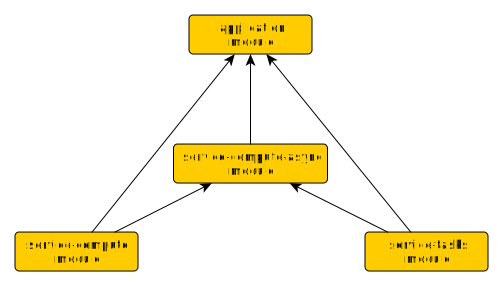

# Simple Java 11 modules example
This simple example shows modular java 11 gradle project.
Main application uses 3 modules as shown in architecture diagram.



### Compile & Run with Java 11
```gradle clean build installDist distZip```  
```./application/build/install/application/bin/application```

### Run optimized build by jlink
After gradle full build, run ```./jlink.sh``` script.
This script will create customized JRE build with application modules.
Go to directory ```application/build/app-runtime-distro/bin```
and start application using ```./launch``` script.
Directory ```application/build/app-runtime-distro``` contains complete
runtime environment: JRE + modules (~75M).

